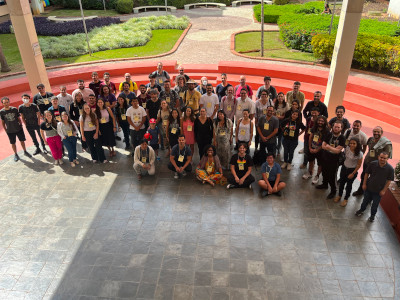
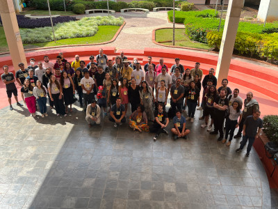
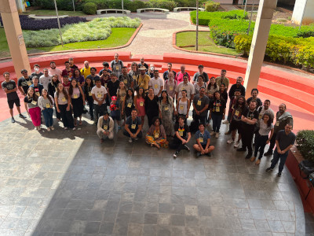
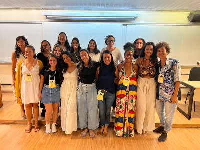
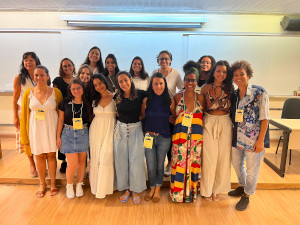
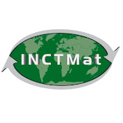

O encontro será realizado nos dias 09, 10 e 11 de maio de 2023 no [Instituto de Ciências Exatas](https://www.icex.ufmg.br) da [Universidade Federal de Minas Gerais](https://ufmg.br) (UFMG), Belo Horizonte, MG.

Nos últimos anos, a área de pesquisa Álgebra tem se tornado uma das mais promissoras na Matemática. A pesquisa desenvolvida pelos jovens algebristas no Brasil tem se destacado no cenário internacional com a formação de parcerias e publicação de resultados importantes nas mais diferentes subáreas de atuação.

Pensando na comunidade de jovens algebristas formados nos últimos anos nos diversos programas de pós-graduação de modo geral, entendemos que é importante a realização de eventos para que estes possam interagir e falar sobre o progresso de seus trabalhos. 

O evento contará com apresentações de palestras,  e também de pôsteres,  por jovens pesquisadores da área de Álgebra das mais diversas instituições e regiões do Brasil.  O dia 11/05 será dedicado à celebração das mulheres na álgebra, antecipando as comemorações pelo dia das mulheres na matemática, o qual é celebrado mundialmente no dia 12/05.

## Palestrantes

- Adriana Juzga Leon (UFMG)
- Aislan Leal Fontes (UFSE)
- Claudemir Fideles Bezerra Jr. (Unicamp)
- Dafne Bessades (Unicamp)
- Daniela Alves de Oliveira (ICMC-USP)
- Danilo Sanção da Silveira (UFOP)
- Elkin Oveimar Quintero Vanegas (UFAM)
- Felipe Yukihide Yasumura (IME-USP)
- Fernando Augusto Naves (UFLA)
- Grasiela Martini (UFRGS)
- José Alves Oliveira (UFLA)
- José Luis Vilca Rodriguez (IME-USP)
- Luis Augusto de Mendonça (UFMG)
- Manuela da Silva Souza (UFBA)
- Maria Luiza Oliveira Santos (UFF)
- Martino Garonzi (UnB)
- Mateus Eduardo Salomão (UTFPR)
- Monique Muller (UFSJ)
- Oscar Armando Hernández Morales (IME-USP)
- Raimundo de Araújo Bastos Júnior (UnB)
- Ricardo Luiz Souza (Colégio Batista Mineiro)
- Sarah Faria Monteiro Mazzini Costa (UFU)
- Victor Pretti (IME-USP)
- Willian Goulart Gomes Velasco (UFPR)
- Willian Versolati França (UFJF)

## Fotos do evento 

Clique na foto para baixar com resolução alta.

 

  

 

 

 &emsp; &emsp;  &emsp; &emsp; 
